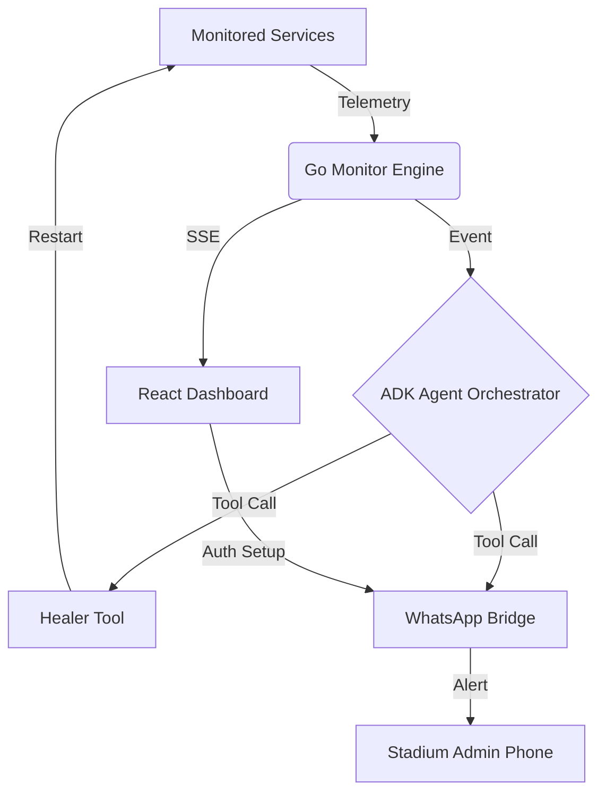

# 🏟️ Stadium Sentinel V2

**Autonomous Infrastructure Guardian & Self-Healing Agent**

Stadium Sentinel is a high-performance, LLM-driven monitoring and automated recovery system designed for stadium infrastructure. It uses the **Google ADK (Agent Development Kit)** and **Gemini Flash** to proactively identify, diagnose, and repair service failures before they impact fans.

## ✨ Features

- **🧠 Autonomous Agent Orchestration**: Powered by Google ADK. The agent doesn't just alert; it makes intent-based decisions on how to heal services.
- **🛡️ Self-Healing Engine**: Integrated `RestartService` tools allow the agent to attempt mechanical recoveries with multi-retry logic.
- **📱 Native WhatsApp Authentication**: A premium, web-based QR scanning interface (via SSE) to register admin phone numbers for high-priority alerts.
- **🎨 Premium Glassmorphic Dashboard**: A cutting-edge React dashboard featuring Framer Motion animations, Lucide icons, and real-time event streaming.
- **🚀 Single-Binary Deployment**: The Go backend serve the entire React SPA from an embedded filesystem (`go:embed`).
- **📊 Observability**: Native OpenTelemetry integration for tracing "Agent Thought Processes".

## 🛠️ Technology Stack

- **Backend**: Go (Official ADK, `whatsmeow`, `genai`)
- **Frontend**: React (Vite, `framer-motion`, `lucide-react`)
- **Intelligence**: Google Gemini Flash
- **Database**: SQLite (for WhatsApp session persistence)
- **Deployment**: Docker (Multi-stage build)

## 🚦 Quick Start

### 1. Requirements
- Go 1.26+
- Node.js 24+
- A Google API Key (`GOOGLE_API_KEY`)

### 2. Run Locally
```bash
# Clone the repository
git clone https://github.com/Parthtiw710/Stadium-Sentinel.git
cd Stadium-Sentinel

# Set your API Key
export GOOGLE_API_KEY="your_api_key_here"

# Build and run the sentinel
go build -o sentinel ./cmd/sentinel/
./sentinel
```

### 3. Open the Dashboard
Navigate to `http://localhost:8080`.
1. Enter your WhatsApp number.
2. Scan the QR code rendered in the UI.
3. Watch the Sentinel start monitoring your stadium infrastructure.

## 🐳 Docker Deployment

```bash
docker build -t stadium-sentinel .
docker run -p 8080:8080 -e GOOGLE_API_KEY="AI..." stadium-sentinel
```

## 🗺️ Architecture



## 📜 License
MIT
